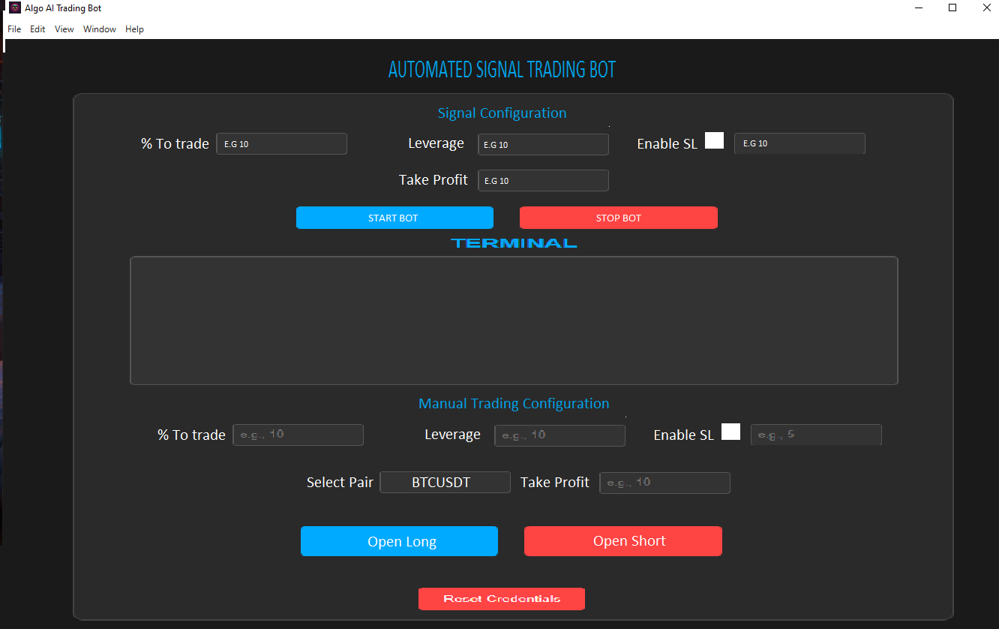

# 👋 Hi, I'm Jose Miguel Cruz

##  Full-Stack Developer | AI & Blockchain Engineer | Trading Automation Specialist

Welcome to my GitHub profile! I'm a passionate software developer with a deep focus on building **automated trading systems**, **AI-powered apps**, **blockchain solutions**, and **real-time data tools**.

I help businesses and individuals by creating smart, scalable, and innovative technology.

---

##  What I Do

- Automated Trading Bots** for crypto and forex (real-time, AI-driven, high-frequency)
- Telegram & WhatsApp Bots** with GPT-4 integration
- DApps, Tokens & Web3** development on Ethereum, BNB Chain, and Solana
- AI Models** for forecasting, classification, and trading signal filtering
- Mobile & Desktop Apps** with SQL databases and cloud sync
- Blockchain Integrations** with smart contracts and wallet connections
- Web Development** with Node.js, Express, React & API integrations

---

## Project Showcase

> Some images of 1 Live Leading Indicator and Automated Trading Bot

---

## 🔗 My Bots (Live)

- **Telegram Bot**: (https://t.me/CryptoGlobalForecaster_bot)
- **WhatsApp Bot**: (https://wa.link/su0fz1)

---

## 🔗 Connect with Me

- [LinkedIn Profile](https://www.linkedin.com/in/jose-cb-952462295/)

---

> Let’s build something awesome together!
